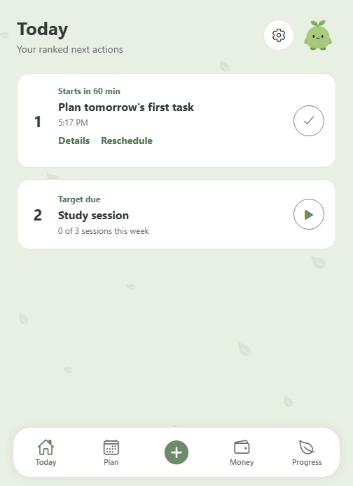
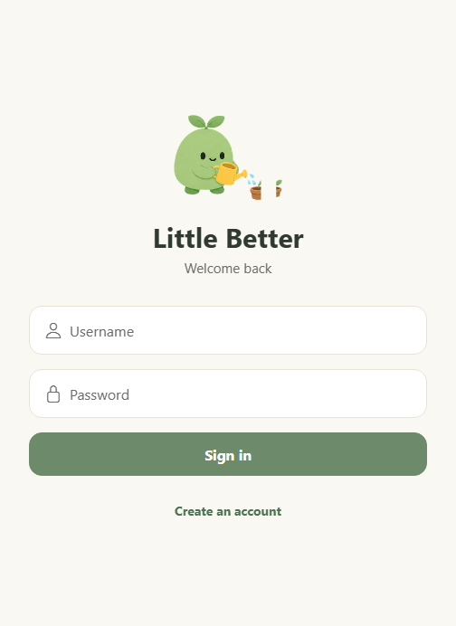
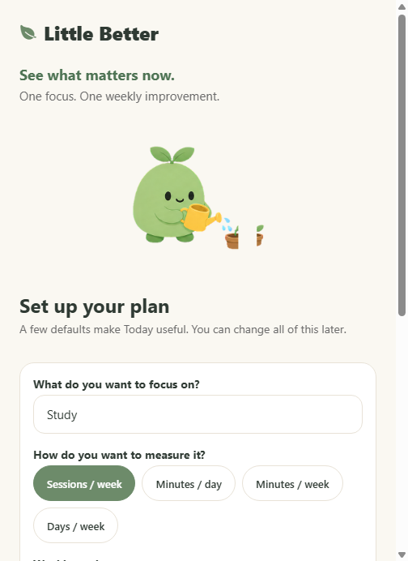
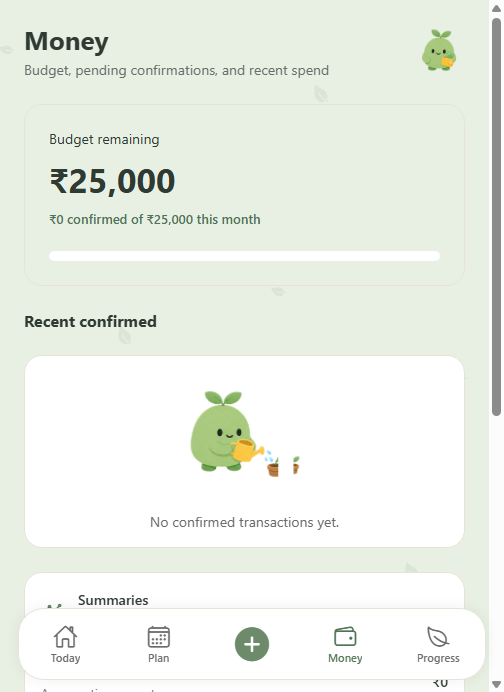
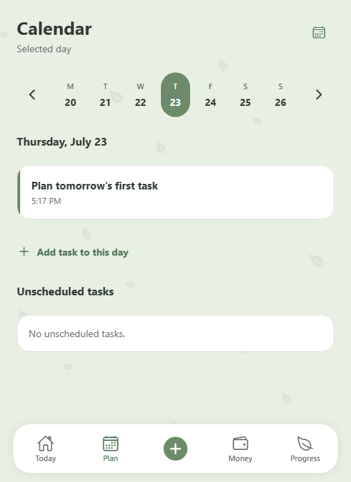
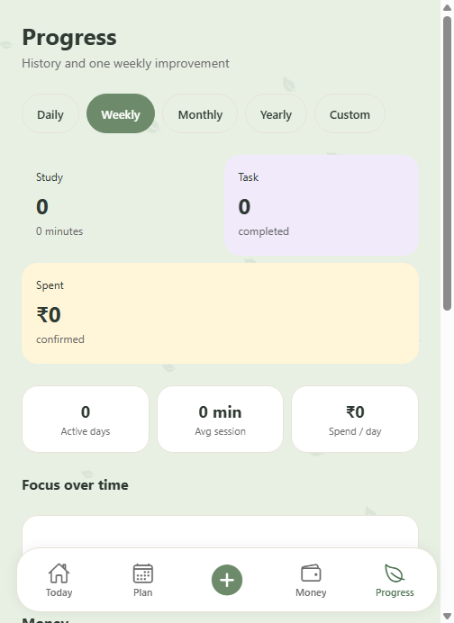
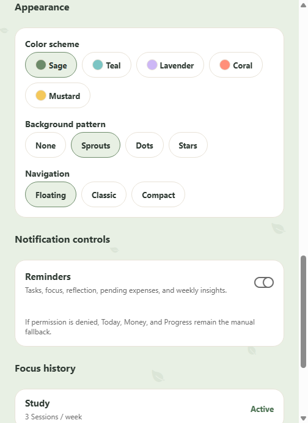

# Little Better

Little Better is a privacy-minded daily planning app for doing one thing a little better each day. It combines a ranked Today view, one active focus habit, calendar planning, lightweight money tracking, reflection, weekly insights, and a gentle Sprout mascot system.

The app is built with Expo, React Native, Expo Router, and Convex.



## Features

- **Ranked Today** - highlights what needs attention now: active focus, overdue tasks, upcoming tasks, pending money confirmations, and reflection prompts.
- **One focus category** - tracks one active improvement area at a time, with timer sessions, manual sessions, weekly targets, and preserved history when switching categories.
- **Calendar planning** - schedule tasks, move unfinished work, log focus sessions, and pick dates/times with mobile-friendly controls.
- **Money awareness** - monthly budget remaining, pending transaction review, confirmed transaction history, account filtering, custom categories, and simple category summaries.
- **Capture flow** - add tasks, expenses, payment alerts, focus sessions, notes, and voice-captured actions from one Quick Add sheet.
- **Weekly insights** - derives simple patterns from completed focus sessions, tasks, reflections, and confirmed transactions.
- **Reflection loop** - evening reflection with skip/snooze controls and private notification defaults.
- **Themes and Sprout assets** - five calm color schemes, selectable background patterns, navigation styles, and a shared Sprout sprite sheet.
- **Android payment notification support** - optional Android notification listener plumbing for payment detection.
- **Offline capture queue** - selected capture actions can be queued locally and synced later.

## Screenshots

All screenshots below use demo data.

| Login | Onboarding |
| --- | --- |
|  |  |

| Today | Money |
| --- | --- |
|  |  |

| Calendar | Progress |
| --- | --- |
|  |  |

### Themes



Little Better currently ships these app themes:

- Sage
- Teal
- Lavender
- Coral
- Mustard

## Project Structure

```text
apps/mobile/              Expo React Native app
apps/mobile/app/          Expo Router screens
apps/mobile/convex/       Convex schema and backend functions
apps/mobile/src/          Shared parser, UI, notification, and offline helpers
apps/mobile/assets/       Icons, splash art, and Sprout sprite sheet
assets/screenshots/       Public demo screenshots
```

## Tech Stack

- Expo SDK 57
- React Native 0.86
- React 19
- Expo Router
- Convex and Convex Auth
- TypeScript
- Android prebuild support

## Getting Started

Install dependencies from the repo root:

```sh
npm install
```

Copy the mobile environment template and fill in your own values:

```sh
cp apps/mobile/.env.example apps/mobile/.env.local
```

Run the mobile app:

```sh
npm run dev:mobile
```

Run Convex:

```sh
npm run dev:convex
```

Convex commands should be run from `apps/mobile` when using the Convex CLI directly:

```sh
cd apps/mobile
npx convex dev
```

## Checks

```sh
npm run typecheck
npm run lint
npm --workspace apps/mobile run test:capture
```

For Expo dependency health:

```sh
cd apps/mobile
npx expo-doctor
npx expo install --check
```

## Android Build

Generate native Android files when needed:

```sh
cd apps/mobile
npx expo prebuild --platform android --clean --no-install
```

Build an APK from the generated Android project:

```sh
cd apps/mobile/android
./gradlew :app:assembleRelease
```

## Privacy Notes

- Do not commit `.env.local`, API keys, deployment URLs, credentials, production data, or personal screenshots.
- Public screenshots in this repository use demo data only.
- Payment notification access is optional and Android-specific.

## License

See [apps/mobile/LICENSE](apps/mobile/LICENSE).
