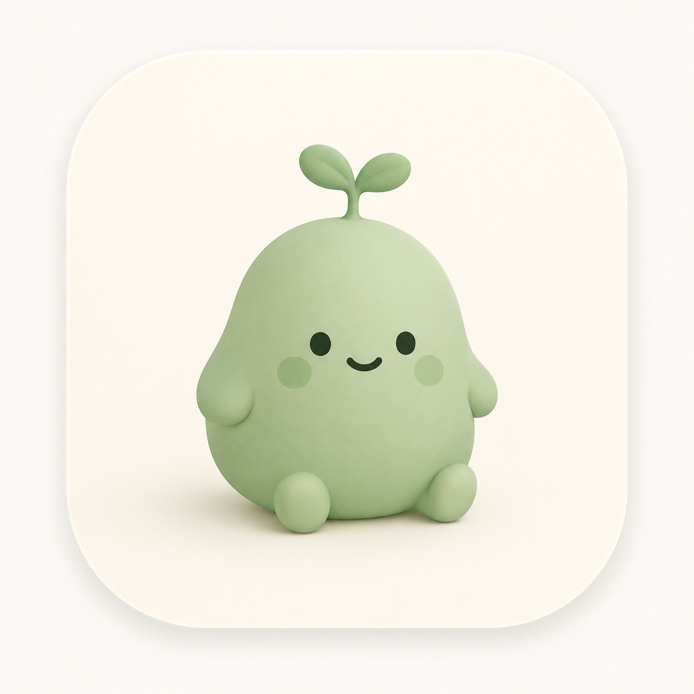
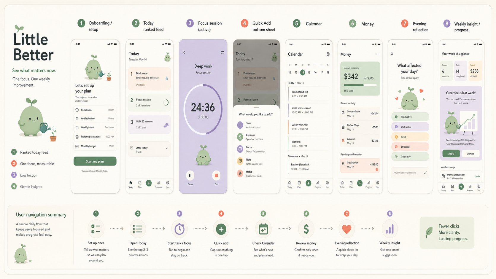
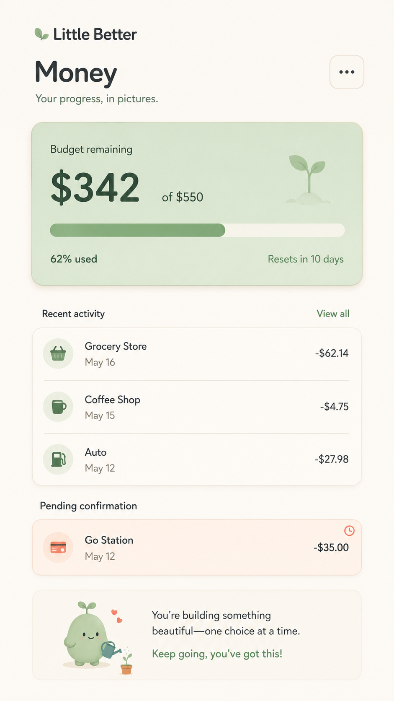
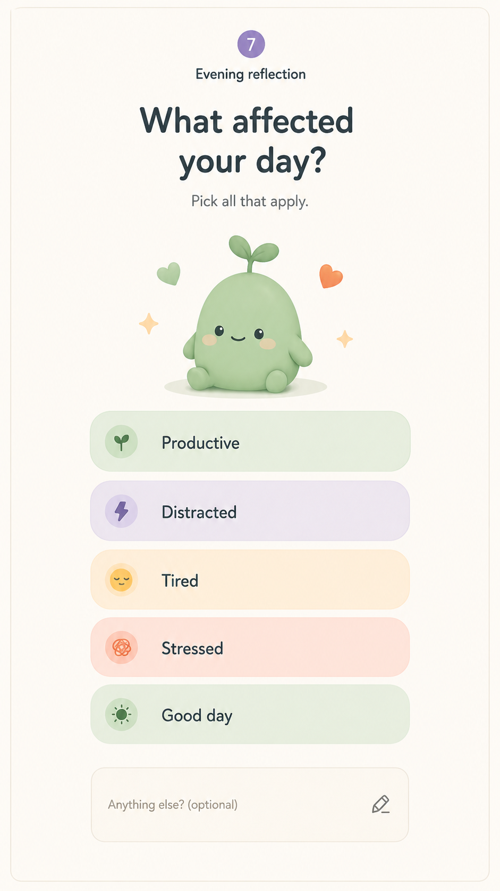
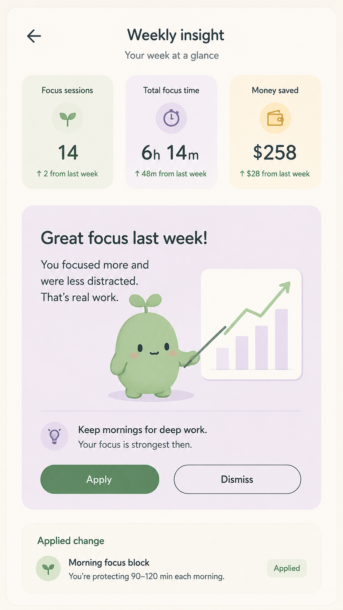
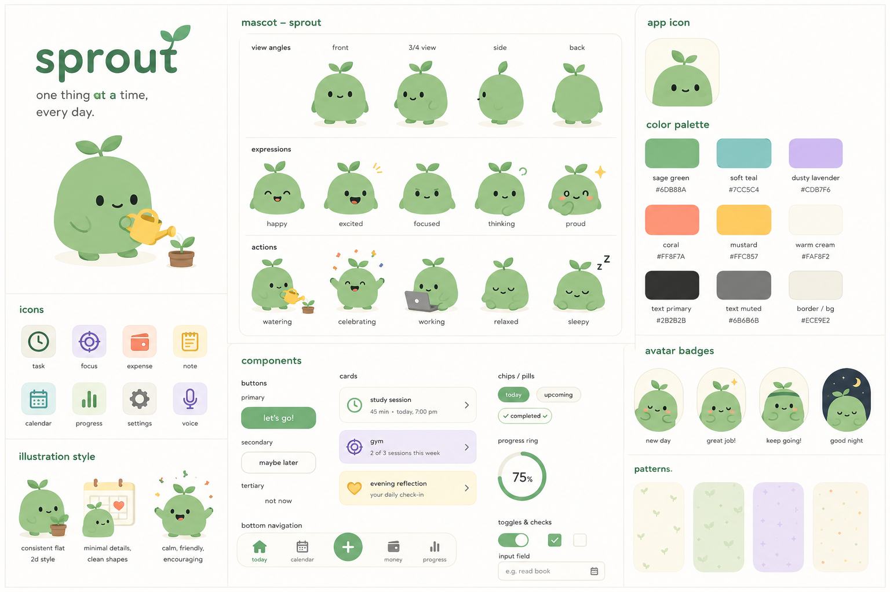

**Little Better**

**Product Design Document**

*See what matters now. One focus. One weekly improvement.*

<table>
<colgroup>
<col style="width: 100%" />
</colgroup>
<thead>
<tr class="header">
<th>
<strong>Document purpose</strong>

This document defines the product experience, interaction model, visual system, screen behavior, edge cases, and v1 acceptance criteria for Little Better. It is the source of truth for product design and implementation decisions.
</th>
</tr>
</thead>
<tbody>
</tbody>
</table>

| **Product**       | Little Better                     |
|-------------------|-----------------------------------|
| **Document type** | Product + UX design specification |
| **Version**       | v1.0                              |
| **Status**        | Build-ready concept               |

# 1. Product Definition

## 1.1 Product statement

Little Better is a daily planning and self-improvement app that ranks what matters now, tracks one chosen focus category, keeps money management accessible but unobtrusive, and turns weekly behavior into one concrete, reversible improvement.

<table>
<colgroup>
<col style="width: 100%" />
</colgroup>
<thead>
<tr class="header">
<th>
<strong>Core promise</strong>

The user should never need to interpret a dense dashboard. The product shows the next useful action, records routine behavior with minimal friction, and converts reliable patterns into one change the user can apply.
</th>
</tr>
</thead>
<tbody>
</tbody>
</table>

## 1.2 Problem

- Most life trackers demand more effort than the behavior they are meant to improve.

- Task apps show everything but rarely help users decide what matters now.

- Habit apps encourage users to track too many behaviors at once, causing abandonment.

- Personal data is usually displayed as charts without producing a practical next action.

- Expense tools are often too accounting-heavy for users who only want awareness and control.

## 1.3 Product principles

| **Principle**                | **Meaning in the product**                                                     |
|------------------------------|--------------------------------------------------------------------------------|
| One thing now                | Today prioritizes the next actions instead of exposing every metric.           |
| One tracked focus            | The user actively improves one category at a time.                             |
| Action before analysis       | Insights must lead to an explicit setting or schedule change.                  |
| Automation with confirmation | Detected expenses remain pending until trusted by the user.                    |
| Minimal input                | Frequent actions require one tap; compound actions may use text or voice.      |
| Calm, not gamified           | No streak anxiety, aggressive badges, confetti overload, or punitive language. |
| Visible control              | Applied recommendations are visible, editable, and undoable.                   |

## 1.4 Core user story

<table>
<colgroup>
<col style="width: 100%" />
</colgroup>
<thead>
<tr class="header">
<th>
<strong>Primary story</strong>

I open Today, see what matters now, act on it, log anything important quickly, and receive one useful adjustment each week.
</th>
</tr>
</thead>
<tbody>
</tbody>
</table>

## 1.5 Product boundaries

| **Included in v1**                     | **Explicitly excluded from v1**                 |
|----------------------------------------|-------------------------------------------------|
| Ranked Today feed                      | Multi-project professional task management      |
| Calendar and scheduled tasks           | Team collaboration and social features          |
| One tracked focus category             | Multiple simultaneous habits                    |
| Focus timer                            | Detailed workout plans and biometric analysis   |
| Money tab with trusted transactions    | Full accounting, investments, credit management |
| Evening reflection                     | Long-form journaling system                     |
| Weekly insight with apply/edit/dismiss | Open-ended life-coach chatbot                   |
| Quick capture by tap/text/voice        | Unconfirmed automatic changes                   |

# 2. Users and Jobs to Be Done

## 2.1 Primary user

A student, early-career professional, creator, or independent worker who wants structure but does not consistently maintain spreadsheets, habit dashboards, detailed budgets, or journals.

## 2.2 Behavioral characteristics

- Frequently feels overwhelmed by long task lists.

- Wants progress across work, health, hobbies, and money, but cannot sustain multiple trackers.

- Responds better to a small prompt than to a large dashboard.

- May postpone planning and rely on memory until tasks become urgent.

- Values automation but distrusts silent or incorrect data capture.

- Needs encouragement without childish gamification.

## 2.3 Core jobs

| **When...**                   | **I want to...**                      | **So that...**                                     |
|-------------------------------|---------------------------------------|----------------------------------------------------|
| I open the app during the day | See the most relevant next actions    | I can begin without reviewing everything.          |
| I begin focused work          | Start a timer in one tap              | My effort is recorded without extra logging.       |
| I receive a UPI transaction   | Confirm or correct it quickly         | My budget remains accurate.                        |
| My day ends                   | Record what affected it in seconds    | Patterns have useful context.                      |
| A week ends                   | See one reliable pattern and action   | I improve without analyzing charts myself.         |
| My plan changes               | Reschedule or capture changes quickly | The system stays useful instead of becoming stale. |

# 3. Product Loop and Information Architecture

## 3.1 Core loop

1.  Plan tasks and select one tracked focus category.

2.  Today ranks the most relevant actions.

3.  Complete tasks or run focus sessions.

4.  Confirm detected expenses only when attention is required.

5.  Complete a short evening reflection.

6.  Receive one evidence-based weekly suggestion.

7.  Apply, edit, dismiss, or undo the suggestion.

*Reference product flow and visual direction. Final UI should follow the stricter visual system defined later in this document.*

## 3.2 Navigation

| **Destination** | **Purpose**                          | **Primary actions**                                        |
|-----------------|--------------------------------------|------------------------------------------------------------|
| Today           | Ranked actions and active state      | Start, complete, reschedule, reflect, confirm urgent items |
| Calendar        | Source of truth for planned time     | Create, schedule, move, inspect day/week                   |
| Money           | Budget and transaction management    | Confirm, edit, categorize, review                          |
| Progress        | Focus history and weekly improvement | Review pattern, apply/edit/dismiss, undo                   |
| Central +       | Quick capture from any main tab      | Task, expense, focus session, note, voice                  |

## 3.3 Click minimization rules

- Frequent actions must be directly available on the relevant card.

- Completing a task: one tap.

- Starting the recommended focus session: one tap.

- Pausing or ending an active timer: one tap.

- Confirming a correct expense: one tap.

- Adding a common item through Quick Add: two taps maximum before input.

- Notifications deep-link to the exact action, never a generic home screen.

- No confirmation modal for reversible low-risk actions; provide Undo instead.

- Confirmation is mandatory for inferred or compound actions.

# 4. Today Ranking Model

## 4.1 Layout model

Today is a ranked list, not a single-card interface and not a dashboard. It shows up to three expanded action cards. Remaining items appear beneath a collapsed “Later today” row.

## 4.2 Priority order

| **Rank** | **Item**                               | **Behavior**                                                                                 |
|----------|----------------------------------------|----------------------------------------------------------------------------------------------|
| 1        | Active timer                           | Always remains first until paused or stopped. New tasks do not interrupt the active session. |
| 2        | Overdue task                           | Highest unresolved planned obligation.                                                       |
| 3        | Task starting within 60 minutes        | Surfaces preparation or immediate start.                                                     |
| 4        | Accepted weekly action due now         | A scheduled improvement the user explicitly accepted.                                        |
| 5        | Tracked focus target not yet completed | Appears only when contextually relevant and no higher item displaces it.                     |
| 6        | Next scheduled task                    | Provides the next planned commitment.                                                        |

<table>
<colgroup>
<col style="width: 100%" />
</colgroup>
<thead>
<tr class="header">
<th>
<strong>Reflection exception</strong>

Evening reflection is not ranked. At the configured reflection time, it appears above the ranked list until completed, dismissed, or snoozed.
</th>
</tr>
</thead>
<tbody>
</tbody>
</table>

## 4.3 Card behavior

| **Card type**        | **Primary action** | **Secondary actions** | **Completion behavior**                          |
|----------------------|--------------------|-----------------------|--------------------------------------------------|
| Active timer         | Pause / resume     | End session           | Remains pinned until stopped                     |
| Task                 | Start or complete  | Reschedule, details   | Gently scales down and fades; Undo toast appears |
| Focus target         | Start session      | Adjust target         | Updates weekly progress                          |
| Weekly action        | Perform action     | Edit, dismiss         | Collapses after completed or dismissed           |
| Expense confirmation | Confirm            | Edit, ignore          | Leaves Today after resolution                    |

## 4.4 Empty and low-load states

- No tasks: show one calm empty state and a single “Add your first task” action.

- All tasks complete: show the mascot in a small celebration state and the next meaningful event, if any.

- No focus target due: do not manufacture a prompt.

- No recommendation yet: show no insight card on Today.

- Do not fill empty space with generic motivational content.

# 5. Focus Category and Session Model

## 5.1 One tracked category

The product does not have a separate habit system. The user chooses one tracked focus category. The category may be Study, Work, Gym, Reading, Meditation, Drawing, Music, or a custom activity.

## 5.2 Targets

| **Target type**   | **Example**          | **Recorded outcome**    |
|-------------------|----------------------|-------------------------|
| Sessions per week | Gym: 3 sessions      | Completed session count |
| Minutes per day   | Reading: 20 minutes  | Accumulated duration    |
| Minutes per week  | Drawing: 180 minutes | Accumulated duration    |
| Binary days       | Meditation: 5 days   | One completion per day  |

## 5.3 Session linkage

Starting a focus session in the tracked category updates the tracked target automatically. There is no duplicate habit record. A manually completed category session and a timer-completed session both resolve to the same session history, while retaining the capture source.

## 5.4 Switching category

- Previous category history remains accessible in Progress.

- A new category begins with no inherited assumptions.

- The app shows “Not enough data yet” until the category reaches at least five sessions or seven tracked days, depending on target type.

- No comparative insight is generated from insufficient data.

- Switching categories does not delete or merge historical records.

# 6. Money Experience

## 6.1 Role in the product

Money is a core product area but not a permanent Today widget. It appears on Today only when the user must resolve something, such as a pending transaction or an exceeded budget threshold.

## 6.2 Transaction trust model

| **Source**                    | **Initial state**                                 | **Affects totals?** | **Required action**         |
|-------------------------------|---------------------------------------------------|---------------------|-----------------------------|
| UPI/payment notification      | Pending                                           | No                  | Confirm, edit, or ignore    |
| Manual entry                  | Confirmed                                         | Yes                 | None                        |
| Voice/text extraction         | Pending preview                                   | No                  | Confirm or edit before save |
| Imported verified integration | Confirmed or review, depending on source contract | Only when verified  | Resolve only if flagged     |

## 6.3 Money screen

- Budget remaining card with current month amount and progress.

- Pending confirmations placed above transaction history when present.

- Recent confirmed transactions.

- Category summary and monthly trend in the deeper view.

- No investment, debt, tax, or accounting features in v1.

*Money screen reference: calm hierarchy, one primary budget card, visible pending confirmation, neutral transaction list.*

## 6.4 Money insight precedence

A money insight is eligible only when no task or focus pattern clears the same reliability threshold. This prevents money from competing with the product’s primary action and focus loop unless it is the only strong actionable pattern.

# 7. Evening Reflection

## 7.1 Purpose

The reflection adds qualitative context without becoming a journal or mood tracker. It helps explain why task and focus behavior changed.

## 7.2 Interaction

- Triggered at a user-selected evening time.

- Appears above Today rather than inside the ranked priority system.

- User may select multiple quick descriptors: Productive, Distracted, Tired, Stressed, Good day.

- Optional short text: “Anything else?”

- Actions: Done, Skip for now, Snooze.

- No numeric mood or energy score.

*Evening reflection reference. Final implementation should use flat 2D illustration and consistent component sizing.*

## 7.3 Data usage

- Reflection tags can contextualize focus completion and task postponement.

- Free text is preserved verbatim.

- Derived tags must never replace the original text.

- No insight should imply causality from a few reflections.

- Sensitive reflection text is never shown in notifications.

# 8. Weekly Insight System

## 8.1 Product role

Weekly insight is the primary differentiator. Its purpose is not to summarize every metric. It identifies one reliable, understandable pattern and offers one explicit change.

## 8.2 Eligibility

- Use only confirmed transactions and completed/recorded sessions.

- Require the minimum data threshold for the relevant pattern.

- Do not generate an insight when the evidence is weak or contradictory.

- Prefer task/focus patterns; money is a tiebreaker only when those do not qualify.

- Display “Not enough data yet” rather than filler advice.

## 8.3 Insight anatomy

| **Part**         | **Example**                                                         |
|------------------|---------------------------------------------------------------------|
| Observation      | You complete more study sessions after 7 PM.                        |
| Evidence         | 4 of 5 evening sessions completed versus 1 of 4 afternoon sessions. |
| Suggested action | Move the weekday study reminder to 7:30 PM.                         |
| Controls         | Apply, Edit, Dismiss                                                |
| After apply      | Setting changes visibly; an Undo option remains available.          |

## 8.4 Allowed actions

- Move a reminder or recurring focus block.

- Reduce or increase a target within reasonable bounds.

- Split a repeatedly postponed task.

- Schedule a focus block at a more successful time.

- Adjust a budget threshold when the user explicitly approves.

- Change only settings that are visible and reversible.

*Weekly insight reference: one clear recommendation, small evidence summary, explicit Apply and Dismiss controls.*

# 9. Screen Specifications

## 9.1 Onboarding

| **Dimension** | **Specification**                                                                                                                     |
|---------------|---------------------------------------------------------------------------------------------------------------------------------------|
| Goal          | Configure the minimum information needed to produce useful Today cards.                                                               |
| Content       | Tracked focus category, weekly/daily target, preferred focus time, evening reflection time, monthly budget, notification permissions. |
| Interaction   | Progressive single-column setup. Defaults are suggested but editable. One primary button per screen.                                  |
| Exit criteria | User can reach Today without connecting calendar, health, or notification access. Optional permissions must be skippable.             |

## 9.2 Today

| **Dimension** | **Specification**                                                                                                |
|---------------|------------------------------------------------------------------------------------------------------------------|
| Goal          | Show the top two or three actions without dashboard overload.                                                    |
| Content       | Reflection when due, active timer, ranked task/focus/action cards, urgent expense confirmation, Later today row. |
| Interaction   | Direct actions on cards; swipe gestures are optional enhancements, never required.                               |
| Constraint    | No permanent money, sleep, water, gym, or chart widgets.                                                         |

## 9.3 Focus session

| **Dimension** | **Specification**                                                                           |
|---------------|---------------------------------------------------------------------------------------------|
| Goal          | Keep the user in one activity with no navigational noise.                                   |
| Content       | Category, elapsed/remaining time, progress ring, small calm mascot, pause and end controls. |
| Interaction   | Active timer persists across app navigation and always owns rank 1 on Today.                |
| Completion    | Ask for no extra form by default. Optional note may be added after completion.              |

## 9.4 Quick Add

| **Dimension** | **Specification**                                                                          |
|---------------|--------------------------------------------------------------------------------------------|
| Goal          | Capture an unplanned item from anywhere.                                                   |
| Content       | Task, Expense, Focus session, Note, Voice.                                                 |
| Interaction   | Bottom sheet. One tap selects type. Voice and text show a structured confirmation preview. |
| Constraint    | Do not duplicate one-tap actions already present on Today cards.                           |

## 9.5 Calendar

| **Dimension** | **Specification**                                                                              |
|---------------|------------------------------------------------------------------------------------------------|
| Goal          | Serve as the single source of truth for planned time.                                          |
| Content       | Week strip, selected-day agenda, scheduled tasks, focus blocks, unscheduled tasks.             |
| Interaction   | Tap to inspect; create and reschedule with minimal steps. Dense month grid is not the default. |

## 9.6 Money

| **Dimension** | **Specification**                                                                   |
|---------------|-------------------------------------------------------------------------------------|
| Goal          | Provide trustworthy budget awareness without accounting complexity.                 |
| Content       | Budget remaining, pending confirmations, recent transactions, category/month views. |
| Interaction   | Confirm correct transaction in one tap; edit category/amount in a compact sheet.    |

## 9.7 Reflection

| **Dimension** | **Specification**                                            |
|---------------|--------------------------------------------------------------|
| Goal          | Close the day with useful qualitative context.               |
| Content       | Five quick descriptors, optional short note, Done and Skip.  |
| Interaction   | Time-triggered surface; not buried in settings or Quick Add. |

## 9.8 Progress

| **Dimension** | **Specification**                                                                                        |
|---------------|----------------------------------------------------------------------------------------------------------|
| Goal          | Show meaningful history and the weekly improvement.                                                      |
| Content       | Tracked category history, task completion summary, reflection summary, current insight, applied changes. |
| Constraint    | No large collection of vanity charts.                                                                    |

# 10. States, Errors, and Edge Cases

| **Scenario**                              | **Expected experience**                                                                  |
|-------------------------------------------|------------------------------------------------------------------------------------------|
| Active timer when task start time arrives | Timer remains pinned. Task appears beneath it and may issue a non-blocking notification. |
| Multiple overdue tasks                    | Show the most urgent overdue task; remaining overdue tasks stay in Later today.          |
| No data for insight                       | Show “Not enough data yet” with the exact requirement.                                   |
| Habit/focus category changed midweek      | Preserve old history; new category starts a fresh eligibility window.                    |
| Duplicate UPI notifications               | Group likely duplicates and require one confirmation.                                    |
| Failed/refunded payment detected          | Do not count as confirmed spending; show a resolution state if necessary.                |
| User dismisses reflection                 | Do not repeatedly nag that night. Offer the next scheduled reflection normally.          |
| Task completed accidentally               | Show immediate Undo.                                                                     |
| Recommendation applied accidentally       | Applied change is visible with Undo in Progress and relevant setting.                    |
| Permission denied                         | Explain the lost convenience, provide manual fallback, and keep the product usable.      |
| Offline use                               | Allow task, timer, manual expense, and reflection capture; synchronize later.            |
| Empty day                                 | Show one calm next-step prompt, not an empty dashboard.                                  |

# 11. Notifications and Push UX

## 11.1 Notification types

| **Type**        | **Trigger**                                 | **Primary action**   |
|-----------------|---------------------------------------------|----------------------|
| Upcoming task   | Configured lead time                        | Open exact task card |
| Focus reminder  | User-selected time or applied weekly change | Start session        |
| Reflection      | Configured evening time                     | Open reflection      |
| Pending expense | Detected transaction requiring confirmation | Confirm or edit      |
| Weekly insight  | Weekly review ready                         | Open insight card    |

## 11.2 Rules

- Do not infer a “usual focus time” in the first week.

- Notifications must deep-link to the relevant action.

- Avoid multiple simultaneous reminders; combine when possible.

- Never expose reflection text or sensitive transaction details on the lock screen by default.

- Provide clear per-category notification controls.

# 12. Text and Voice Capture

## 12.1 Role

Voice and natural-language text are secondary capture methods for compound actions. They do not replace faster one-tap interactions.

## 12.2 Appropriate uses

- “Add gym tomorrow at 7 PM and remind me 30 minutes before.”

- “Spent ₹450 on groceries.”

- “Move unfinished tasks to tomorrow except the assignment.”

- “I studied algorithms for 90 minutes.”

## 12.3 Confirmation behavior

- Extracted actions appear as editable structured rows.

- Nothing inferred is saved before confirmation.

- Ambiguous dates, amounts, or categories are visibly flagged.

- The user may confirm all, edit individually, or discard.

# 13. Visual Design System

## 13.1 Art direction

- Flat, minimal, cute-minimal rather than loud or aggressively gamified.

- Warm cream backgrounds with generous negative space.

- Rounded cards and controls with subtle borders, not heavy shadows.

- No gradients in core UI or mascot artwork.

- No random decorative elements. Every illustration must support meaning or state.

- Maximum two accent colors visible on one screen, excluding neutrals.

## 13.2 Color tokens

| **Token**          | **Hex**  | **Use**                                          |
|--------------------|----------|--------------------------------------------------|
| Background / cream | \#FAF8F2 | Primary screen background                        |
| Text / charcoal    | \#2F3A33 | Primary text and icons                           |
| Primary sage       | \#6D8B6A | Primary actions, active navigation, growth       |
| Sage surface       | \#E8F0E4 | Success and calm cards                           |
| Lavender           | \#CDB7F6 | Focus and insight contexts                       |
| Coral              | \#FF8F7A | Warnings, pending confirmation, limited emphasis |
| Mustard            | \#F4C85B | Reflection or note accents                       |
| Muted text         | \#6B6B6B | Secondary text                                   |
| Border             | \#E8E2D7 | Subtle outlines and dividers                     |

## 13.3 Typography

- Use one rounded sans-serif family across the product.

- Recommended: SF Pro Rounded on iOS, Nunito Sans or a metrically compatible rounded sans for cross-platform use.

- Sentence case only; avoid all caps.

- Heading weight: semibold or bold. Body weight: regular. Labels: medium.

- Use fixed type tokens rather than arbitrary per-screen sizes.

| **Token**    | **Suggested size** | **Use**                                 |
|--------------|--------------------|-----------------------------------------|
| Display      | 28–32              | Major onboarding or empty-state heading |
| Screen title | 24                 | Top-level page title                    |
| Card title   | 16–18              | Primary action label                    |
| Body         | 14–16              | Descriptions and rows                   |
| Secondary    | 12–13              | Metadata and helper text                |
| Micro        | 11                 | Non-critical labels only                |

## 13.4 Spacing and shape

| **Token**    | **Value**        | **Use**                        |
|--------------|------------------|--------------------------------|
| Base spacing | 4 px             | Underlying grid                |
| Compact gap  | 8 px             | Icon-to-label and small groups |
| Standard gap | 12–16 px         | Rows and cards                 |
| Section gap  | 24–32 px         | Major visual separation        |
| Card radius  | 16–20 px         | Primary cards and sheets       |
| Pill radius  | 999 px           | Tags and compact actions       |
| Touch target | Minimum 44×44 px | All interactive controls       |

# 14. Mascot System

## 14.1 Character definition

The mascot is a flat 2D sprout/blob character representing steady growth. It must remain visually consistent across every screen and asset.

## 14.2 Non-negotiable anatomy

- One rounded sage body.

- Exactly two small stub arms and two small feet when visible.

- Two leaves on one short sprout stem.

- Two dot eyes and one small curved mouth.

- No nose, fingers, extra hands, duplicated limbs, or realistic anatomy.

- Solid flat fills, no volumetric shading, plush texture, realistic light, or 3D rendering.

## 14.3 Usage

| **Context**     | **Expression / action**               | **Scale**       |
|-----------------|---------------------------------------|-----------------|
| Onboarding      | Helpful, watering a small plant       | Medium          |
| Empty state     | Calm, context-specific prop           | Small to medium |
| Focus session   | Closed eyes, calm breathing           | Small           |
| Task completion | Closed happy eyes, tiny upward motion | Very small      |
| Reflection      | Warm neutral smile                    | Medium          |
| Weekly insight  | Pointing to a simple visual           | Small to medium |

*Approved direction for the flat 2D mascot and component family. Ignore the temporary “sprout” label; product name remains Little Better.*

## 14.4 Motion

- Idle: subtle breathing or blink loop.

- Completion: small upward movement and return; no exaggerated bounce.

- Focus: minimal breathing with eyes closed.

- Transitions: soft slide and fade.

- Respect reduced-motion settings and provide static alternatives.

# 15. Accessibility and Inclusive UX

- Meet WCAG AA contrast for all text and essential icons.

- Do not use color as the only indicator of status.

- All touch targets are at least 44×44 px.

- Support system text scaling without clipping or card overlap.

- Provide clear screen-reader labels for timers, progress, transaction status, and controls.

- Mascot and decorative illustrations should not create excessive screen-reader noise.

- Support reduced motion.

- Use plain, non-judgmental language. Avoid “failed,” “lazy,” or shame-based streak language.

- Allow reflection and money notification content to remain private on lock screens.

# 16. Content and Tone

| **Do**                             | **Avoid**                                     |
|------------------------------------|-----------------------------------------------|
| “You have one task starting soon.” | “You are falling behind!”                     |
| “Not enough data yet.”             | Invented motivational insights                |
| “Move your reminder to 7:30 PM?”   | “AI has optimized your life.”                 |
| “Skip for now”                     | Punitive streak-loss warnings                 |
| “Confirm ₹240 at Sharma Cafe”      | Unclear or overly cheerful financial language |
| Short, specific action labels      | Long coaching paragraphs on action screens    |

# 17. Product Success Criteria

## 17.1 Behavioral metrics

| **Metric**                                   | **Initial target**                    |
|----------------------------------------------|---------------------------------------|
| Median time to identify next action on Today | Under 5 seconds                       |
| Task completion interaction                  | 1 tap                                 |
| Start recommended focus session              | 1 tap                                 |
| Expense confirmation when correct            | 1 tap                                 |
| Evening reflection completion time           | Under 20 seconds                      |
| Weekly insight action rate                   | Track Apply, Edit, Dismiss separately |
| Applied-change retention                     | Change remains active after 7 days    |
| Users with 4+ active days per week           | Primary engagement measure            |

## 17.2 Qualitative success

- Users describe Today as clear rather than empty or limited.

- Users understand why an item is shown without needing ranking explanations.

- Users trust money totals because pending transactions are visibly separated.

- Users can explain the weekly suggestion in their own words.

- Users do not feel pressured to track multiple behaviors.

# 18. V1 Acceptance Checklist

| **Area**        | **Acceptance condition**                                                 |
|-----------------|--------------------------------------------------------------------------|
| Today           | Shows at most three expanded ranked actions plus Later today.            |
| Timer           | Active timer remains rank 1 and persists across navigation.              |
| Reflection      | Appears at configured time above ranked content; supports skip/snooze.   |
| Focus           | One tracked category with target and history; no duplicate habit record. |
| Category switch | Old history preserved; new insight threshold resets.                     |
| Money           | Pending detected transactions do not affect totals until confirmed.      |
| Quick Add       | Available from all main tabs; compound capture requires confirmation.    |
| Insight         | One evidence-backed recommendation with Apply/Edit/Dismiss.              |
| Applied change  | Visible and undoable.                                                    |
| First week      | No inferred focus-time claim before enough data.                         |
| Visuals         | Flat 2D mascot, fixed palette, consistent typography and spacing.        |
| Accessibility   | Touch targets, contrast, text scaling, reduced motion supported.         |

# 19. Final Product Summary

<table>
<colgroup>
<col style="width: 100%" />
</colgroup>
<thead>
<tr class="header">
<th>
<strong>Little Better in one sentence</strong>

A calm daily action feed that combines planned time, one measurable focus, trustworthy spending awareness, a short reflection, and one reversible weekly improvement.
</th>
</tr>
</thead>
<tbody>
</tbody>
</table>

The product should resist expansion into an “everything dashboard.” New features belong only when they reduce effort, improve the reliability of the weekly recommendation, or make the next action clearer. Anything that adds permanent widgets, parallel habit systems, or unverified automation contradicts the product’s core design.
